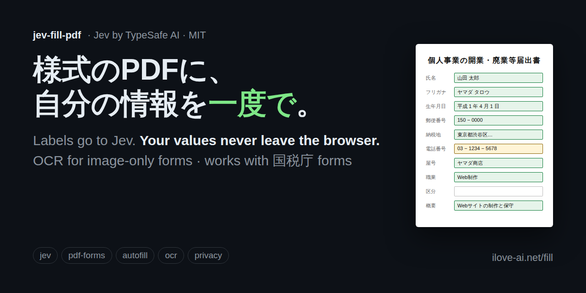

# jev-fill-pdf

**Fill Japanese PDF forms (申請書・届出書) in one click, with [Jev](https://typesafe.ai) by TypeSafe AI.**
Labels go to Jev. Your values never leave the browser.

**Live: [ilove-ai.net/fill](https://ilove-ai.net/fill)** · v0.1.1 · The client is one HTML file (`index.html`); the only server code is the small relay in `api/`.

[日本語はこちら](#日本語)



## Why

Japanese government forms are PDFs with input fields, but the fields are named `テキスト1`…`テキスト62`, the page is a scanned image, and the file is encrypted "no changes allowed". There is not a single label string inside the file for software to read. That is why "auto-fill" tools stop at web forms.

Jev is the missing piece: a model that returns **a choice with probabilities** instead of text. Give it noisy OCR fragments around a field and a list of profile item names, and it tells you *which* item the field is, and *how sure* it is. Cheap enough to ask about all 79 fields in one request.

## The pattern (reusable)

1. **Never send values.** The request to Jev contains field label fragments (`"フリカナ"`, `"地税納"`) and profile *keys* (`氏名`, `フリガナ`, `郵便番号`…). Names, addresses and numbers stay in the browser.
2. **One request, N `choice` questions.** One question per field, criteria = profile keys + `"none"`. Jev evaluates them in parallel.
3. **Act on probability, not on the answer.** ≥ 0.8 fill (green) · 0.5–0.8 fill but ask to confirm (yellow) · below that leave blank and let the user tap-to-pick (grey). Low-confidence fields are never filled silently.
4. **Show what will be sent before sending.** The label list is displayed; nothing goes out until the user clicks.
5. **Remember mappings, not values.** A confirmed field→item mapping is stored per form hash. Popular forms ship as presets, so they fill with no OCR and no API call at all.

Jev is reached through **Vercel AI Gateway** (`typesafe-ai/jev`), which declares `zdr: "all"` and `no_training: "all"` for this model, so the whole path is zero-retention. No TypeSafe account is needed on the server side.

## How it works

1. Drop a form. If it is encrypted (most 国税庁 forms are, "no changes allowed" with an empty user password) it is decrypted in the browser with qpdf-wasm.
2. Fields are found: AcroForm widgets, or, for line-only forms, closed vector paths (pdf.js expands `re` into moveTo/lineTo under a CTM, so the CTM is tracked).
3. Text near each field is collected from the text layer, or, for image-only forms, from OCR (tesseract.js, loaded only after you press the button: `jpn` over the page, `jpn_vert` for the tall row headers, which come back reversed and are sent both ways).
4. **A dialog shows exactly what will be sent** (fragments + your item names). Nothing goes out until you click.
5. The relay asks Jev one `choice` per field in a single request. Probability ≥ 0.8 fills (green), 0.5–0.8 fills and asks you to check (yellow), below that stays blank and you tap to pick (grey).
6. Fill and save: AcroForm fields are set and flattened; line-only forms get text placed inside the boxes. Nothing is embedded unless something is drawn.

A form's **fingerprint** (field names and positions, rounded) keys both the shipped presets and the mappings you confirm by hand. Bytes are not usable as a key: qpdf's decrypted output differs on every run.

## Measured

| | Result |
|---|---|
| 国税庁 開業届 (r06) in headless Chromium | 79 fields, decrypted automatically. OCR 30 s. 47 of 62 text fields get nearby text. The review dialog contains no values (tested). Confirmed mappings store keys only (tested). |
| Preset path (same form) | 25 fields filled with **zero** relay calls; derived values right (1989-04-01 → 平成 1 年 4 月 1 日, 03-1234-5678 → 03 / 1234 / 5678) |
| Live Jev through the production relay | 10 OCR-noisy fields, 1.4 s. Plain item names: 7/10 agree, but 納税地 was confidently mistaken for 税務署名 (0.89 → would fill). With aliases in the descriptions (住所（納税地・住所地・所在地）…): 6/10 agree, **0 confident mistakes** (the same field drops to 0.56 → "please check"). We ship the aliases: green must be trustworthy. |

## Verified on the way (real form: 国税庁 個人事業の開業・廃業等届出書, r06)

| Fact | Result |
|---|---|
| The form | 79 AcroForm fields, names `テキスト1–62` / `Check Box63–79`, no tooltips, **0 text items**, page is a 2481×3508 pt scan, AES-encrypted (no changes) |
| Decrypt → fill in Japanese → flatten | qpdf `--decrypt` exit 0 → pdf-lib sees 79 fields → `setText("東京都渋谷区…")` + checkbox → flatten → readable with pdf.js, 0 widgets left |
| Labels from the image | horizontal OCR of the whole page: 48 lines, mean confidence 65, ~4.6 s in Node. Vertical row headers need `jpn_vert` with PSM 5 and **come back reversed** (`地税納` = 納税地) |
| Text-layer forms with no fields | labels via `getTextContent`, boxes via vector paths (pdf.js 4.x expands `re` into moveTo/lineTo under a CTM). 6/6 boxes matched and filled on a sample |
| Calling TypeSafe from a browser | `Disallowed CORS origin` → a thin server relay is required |

Reproduce:

```sh
npm install
npm run inspect   # what kind of form is this? (downloads the NTA form to .cache/)
npm run fill      # decrypt → fill → flatten → .cache/filled.pdf
npm run ocr       # label fragments around each field (needs poppler's pdftoppm)
npm run flat      # text-layer form: labels + boxes → .cache/flat-filled.pdf
```

## Three kinds of forms

| | Where the fields are | Where the labels come from |
|---|---|---|
| A. Text layer, no fields (Word exports from city halls) | closed vector paths, CTM-aware | `getTextContent` with coordinates |
| B. Text layer + AcroForm (some bank forms) | widget rects | field name, tooltip, nearby text |
| C. **Image + AcroForm (most 国税庁 forms)** | widget rects | **OCR** (tesseract.js, `jpn` + `jpn_vert`), loaded on demand (~9.5 MB) |

## What it will not do

Skew correction for bad scans · handwritten forms · XFA · vertical writing *into* fields · linked fields across pages.

## Built with

[pdf-lib](https://github.com/Hopding/pdf-lib) (MIT) · [pdf.js](https://github.com/mozilla/pdf.js) (Apache-2.0) · [qpdf-wasm](https://github.com/jsscheller/qpdf-wasm) (Apache-2.0) · [tesseract.js](https://github.com/naptha/tesseract.js) (Apache-2.0) · Noto Sans JP (SIL OFL 1.1) · Jev via Vercel AI Gateway.
Sibling project: [generic-pdf](https://github.com/takumi-golf/generic-pdf), a single-file PDF editor that never uploads.

MIT License.

---

<a name="日本語"></a>

## 日本語

**様式のPDFを放り込むと、自分の情報が全部の欄に入る。** TypeSafe AI の Jev を使います。

**公開中: [ilove-ai.net/fill](https://ilove-ai.net/fill)** · v0.1.1 · クライアントは HTML 1 ファイル（`index.html`）。サーバー側は `api/` の薄い中継だけ。

### なぜ Jev か

国税庁の様式は、入力欄はあるのに欄の名前が「テキスト1〜62」で意味がなく、ページは紙をスキャンした画像で、しかも「変更不可」で暗号化されています。**ファイルの中に、プログラムが読めるラベルが1文字もありません。** だから自動入力の道具はWebフォームで止まっていました。

Jev は文章を返さず、**選択肢と確率**を返すモデルです。欄の近くから拾った崩れた文字（「フリカナ」「地税納」）と、あなたの情報の項目名（氏名・フリガナ・郵便番号…）を渡すと、どの項目か、どれくらい確かかを返します。79の欄を1回の問い合わせで判定できるくらい安い。

### 型（他の人も使える形で）

1. **値は送らない。** Jev に送るのはラベルの断片と項目名だけ。名前・住所・番号はブラウザから出ません
2. **1回の問い合わせに、欄の数だけ `choice` を並べる。** 選択肢は項目名＋「該当なし」
3. **答えではなく確率で動く。** 0.8以上は入れて緑、0.5〜0.8は入れて黄色で確認、それ未満は空欄のまま「タップして選ぶ」。自信のない欄を勝手に埋めない
4. **送る前に、送るものを見せる。** 押すまで送らない
5. **覚えるのは対応であって値ではない。** 一度確認した欄と項目の対応は様式ごとに覚える。主要な様式はプリセットとして同梱し、OCRもJevも呼ばずに埋まる

Jev は **Vercel AI Gateway** 経由で呼びます。この経路はモデル一覧で「保持なし・学習不使用」と宣言されています。

### 使い方

1. 様式のPDFを放り込む。暗号化されていれば（国税庁の様式の多くがそう）ブラウザの中で外す
2. 欄を見つける。入力欄があればそれ、線だけの様式なら枠
3. 欄の近くの文字を集める。画像の様式ならボタンを押したときだけ文字の読み取り部品（約10MB）を読み込む
4. **送るものを一覧で見せる。** 押すまで送らない
5. Jev が欄ごとに「どの項目か」と確率を返す。0.8以上は入れて緑、0.5〜0.8は入れて黄色で確認、それ未満は空欄でタップして選ぶ
6. 記入して保存

### 実測

| | 結果 |
|---|---|
| 開業届（r06）・headless Chromium | 79欄・暗号化は自動で外す・OCR 30秒・62の文字欄のうち47に近くの文字。確認ダイアログに値は含まれない（テスト済み）。手で選んだ対応はキーだけ保存（テスト済み） |
| プリセット経路（同じ様式） | 25欄が**中継の呼び出し0回**で埋まる。分割も正しい（1989-04-01 → 平成1年4月1日、03-1234-5678 → 03 / 1234 / 5678） |
| 本番の中継経由で Jev | 崩れたOCR断片10欄・1.4秒。項目名だけだと一致 7/10 だが「納税地」を税務署名と 0.89 で取り違えて自動記入になる。説明に別名を添えると一致 6/10・**確信して間違える欄 0**（同じ欄は 0.56 の「確認して」に落ちる）。緑が信じられることを優先して別名を採用 |

### 途中で確かめたこと（国税庁「個人事業の開業・廃業等届出書」r06）

| 確認 | 結果 |
|---|---|
| 様式そのもの | AcroForm 79欄・欄名は「テキスト1〜62」「Check Box63〜79」・ツールチップ空・**文字層0**・2481×3508ptの画像・AES暗号化（変更不可） |
| 復号→日本語で記入→確定 | qpdf `--decrypt` → pdf-lib で79欄 → 「東京都渋谷区…」と チェック → flatten → pdf.js で読み戻せる |
| 画像からラベル | 横書きOCRでページ全体48行・平均信頼度65・約4.6秒。縦書きの見出しは `jpn_vert`（PSM 5）でしか読めず、**逆順で返る**（「地税納」＝納税地） |
| 文字層あり・欄なしの様式 | ラベルは文字層、枠は経路の外接矩形（CTMを追う）。6枠すべて対応して記入 |
| ブラウザから TypeSafe 直接 | `Disallowed CORS origin`。薄い中継が要る |

### できないこと

スキャンの傾き補正・手書き様式・XFA・縦書きの記入・複数ページにまたがる欄の連動。

MIT ライセンス。姉妹プロジェクト: [generic-pdf](https://github.com/takumi-golf/generic-pdf)（アップロードしないPDF編集ツール・HTML 1枚）。
